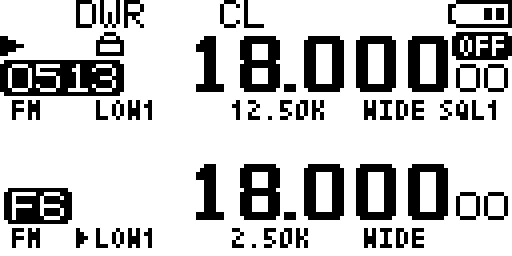
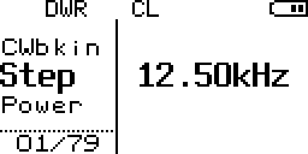
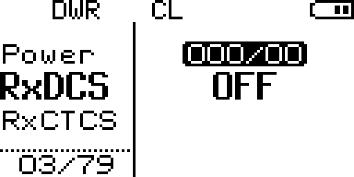

# UV-K5 V3 emulator

Runs Quansheng UV-K5 V3 / UV-K1 firmware on a PC. The radio uses a Puya
PY32F071 (Cortex-M0+), which QEMU has no machine for, so this adds one.

The firmware boots to its main loop in about five seconds, the LCD contents are
readable, and the keypad drives the menus. See [Status](#status) for what is and
is not modelled.

| Main screen | Menu | Navigated with keys |
| --- | --- | --- |
|  |  |  |

Real captures, not mock-ups: `tools/screenshot.py` reads the firmware's
`gFrameBuffer` out of guest memory and renders it, so these are the pixels the
LCD driver actually wrote. Left to right: the dual-watch main screen, the menu
opened with `key.py MENU` (entry 01/79, Step), and 03/79 after `key.py DOWN DOWN`.

## What it is for

Editing firmware and reflashing a radio to test one line is slow, and some bugs
are invisible from the outside. A recent example: CW macro recording appeared to
do nothing, and the cause was three layers down -- the keyer was being torn down
by a later call that recomputed its state from the wrong VFO. On hardware you see
"nothing happens"; here you can read the actual variables.

What it does **not** do is model radio behaviour. It reproduces what the firmware
*commanded* -- frequency, power step, carrier keying in time -- not the analogue
result. Keying envelopes, spurious emissions and sensitivity need a real radio and
a spectrum analyser. That is not a gap to be closed later; the transceiver chip
has no public datasheet, so its driver is the only specification available.

## Status

| Area | State |
| --- | --- |
| Boot to main loop | works, ~5 s |
| LCD contents | readable via `tools/screenshot.py` |
| SPI flash, settings, calibration | works, and persists across power cycles |
| Frequency entry | works, stored per band and kept |
| Keypad and menu navigation | works, including waking from power save |
| Serial output (firmware log) | works, appears in the web UI log |
| Serial input, CPS programming protocol | works, `-serial` any chardev |
| BK4819 register interface | works, RSSI and status readable |
| S-meter | works via monitor (SIDE1); reads -53 dBm, S9+40 |
| PTT and transmit | works; TX annunciator, timer, and mic level bar |
| Speaker / microphone audio | **no samples exist to model**, see [Audio](#audio) |
| Timing accuracy | deliberately wrong, see [Timing](#timing) |
| Analogue RF behaviour | **not modelled and never will be**, see [AGENTS.md](AGENTS.md#the-bk4819-and-where-modelling-it-stops) |

A short `tools/key.py MENU` opens the menu, UP/DOWN move through it, MENU enters
a submenu, and typing a menu number jumps straight to that entry. Press duration
decides short versus held, which the firmware treats as different events -- see
[Timing](#timing).

Press duration is the thing to get right. A hold of 400 ms or more is a *long*
press, and handlers act on it differently: `MAIN_Key_MENU` opens the menu on a
short release and does nothing on the hold path. If a key seems ignored, shorten
the press rather than lengthening it. Waking from power save needs nothing
special -- one 200 ms press both wakes the radio and opens the menu, verified
after 45 s of idle.

`tools/keypad_test.py` checks all of this against a throwaway QEMU instance. It
exists because the keypad has one non-obvious trap: the keypad model's `row_out`
array must stay `volatile`, or GCC at -O2 proves the lines are still NULL and
deletes every call to `keypad_update_rows()`, so no row is ever driven and
keypresses silently stop working. Run the test after touching that code;
`AGENTS.md` has the object-code evidence.

## Layout

    qemu/                    QEMU sources to be copied into a QEMU tree
      py32f071.c             the SoC and machine (the bulk of the work)
      armv7m_systick.*.patched  SysTick with the poll-boost property added
    assets/                  flash.img, plus pristine/ as the reference copy
      calibration.bin        512-byte dump from a real radio
    deploy/                  nginx vhost for the HTTPS front end
    docs/reverse-proxy.md    how https://k6v3.mckero.dn42/ is served
    docs/screenshots/        LCD captures used in this README
    tools/                   run, screenshot, inject keys, probe state
      keypad_test.py         keypad regression test, boots its own instance
      test_flash_persist.py  flash writes survive a power cycle
      test_freq_entry.py     a typed frequency takes effect and persists
      test_serial_rx.py      the firmware answers programming commands
      test_bk4819.py         BK4819 register interface, RSSI not stuck at zero
      test_bk4819_readback.sh  register reads come back bit-aligned
      test_smeter.py         the S-meter reads a signal when monitoring
      test_ptt.py            PTT keys the radio and releases cleanly
      test_scan.py           a busy band does not stall a scan
      test_audio_path.py     the amplifier turns on when the firmware wants sound
      test_battery.py        battery level and low-battery follow the ADC
      run_tests.sh           runs all of the above, build-checked first
      test_run_tests.sh      that the runner actually notices failures
      lib_kill_emulator.sh   cleanup that only ever kills emulators
      webui.py               web remote control: live LCD plus clickable keypad
      dn42_firewall.sh       restrict the web UI port to DN42 sources
      restore_flash.sh       roll the flash image back to its pristine state
      uvk5_qmp.py            QMP client
      uvk5_lcd.py            framebuffer decode, PNG encode, frame grabber
      uvk5_keys.py           key names the keypad model accepts
    harness/, stubs/, shim/, tests/   host build of the CW timing chain (stage A)

## Building

Needs a QEMU 7.2 source tree, `meson`, `ninja`, `libfdt-dev`, `libglib2.0-dev`,
`libpixman-1-dev`.

    # 1. Drop the sources into a QEMU tree
    cp qemu/py32f071.c                   $QEMU/hw/arm/
    cp qemu/armv7m_systick.c.patched     $QEMU/hw/timer/armv7m_systick.c
    cp qemu/armv7m_systick.h.patched     $QEMU/include/hw/timer/armv7m_systick.h

    # 2. Register the machine. In $QEMU/hw/arm/Kconfig:
    #      config UVK5_V3
    #          bool
    #          default y
    #          depends on TCG && ARM
    #          select PY32F071_SOC
    #      config PY32F071_SOC
    #          bool
    #          select ARM_V7M
    #          select UNIMP
    #    In $QEMU/hw/arm/meson.build:
    #      arm_ss.add(when: 'CONFIG_UVK5_V3', if_true: files('py32f071.c'))

    # 3. Build just the ARM target
    cd $QEMU
    ./configure --target-list=arm-softmmu --disable-docs --disable-tools
    cd build && ninja qemu-system-arm

Then check the build actually works, which takes about a minute:

    bash tools/run_tests.sh        # everything, a few minutes
    bash tools/run_tests.sh -q     # unit tests only, ~15 s, no emulator

The runner checks the build first and refuses to continue if it fails, because ninja
leaves the previous binary in place and the tests would otherwise pass against code
that was never compiled. Individual tests still run standalone:

    python3 tools/keypad_test.py
    python3 tools/test_flash_persist.py
    python3 tools/test_freq_entry.py
    python3 tools/test_serial_rx.py
    python3 tools/test_bk4819.py
    bash tools/test_bk4819_readback.sh
    python3 tools/test_smeter.py
    python3 tools/test_ptt.py
    python3 tools/test_scan.py
    python3 tools/test_audio_path.py
    python3 tools/test_battery.py

This matters more than it looks. The keypad can break silently under -O2 without
any compiler warning -- see the `volatile` note in [Status](#status) -- so a clean
build is not evidence that keypresses work. The other two cover the flash path,
where four separate faults each ended up zeroing stored frequencies without
producing any error: details in
[AGENTS.md](AGENTS.md#the-flash-bugs-four-faults-one-symptom).

The rest of the tests:

    cd tools && python3 -m unittest discover -p 'test_uvk5*.py' -v  # fast, no emulator
    cd tools && python3 -m unittest test_webui -v                   # fast, no emulator
    python3 tools/test_webui_e2e.py                                # boots its own emulator

## Running

    python3 tools/make_flash.py     # once, builds assets/flash.img

The emulator writes to that image, so a session can leave edited settings or a
damaged EEPROM behind. `assets/pristine/` holds a checksummed copy of the image as
first generated, and `tools/restore_flash.sh` puts it back:

    tools/restore_flash.sh --verify   # is the reference copy itself intact
    tools/restore_flash.sh --diff     # has the live image changed, and by how much
    tools/restore_flash.sh            # restore, saving the current image first

The reference copy is stored gzipped, which takes 2.3 KiB rather than 2 MiB because
the image is nearly all 0xFF, so it is small enough to keep in git. The live image
stays ignored: it is a build artifact that gets written to.

    tools/run.sh                    # starts the machine

    tools/where.sh                  # where the firmware is executing
    python3 tools/screenshot.py --frame-addr 0x200013DC \
        --status-addr 0x2000175C --port 1234 --out screen.png
    python3 tools/key.py MENU       # inject a keypress
    tools/gpiob_dump.sh             # GPIOB registers

The machine exposes a GDB stub on port 1234 and a QMP socket at
`/tmp/uvk5-qmp.sock`. It is headless: the screen is read out of guest memory
rather than drawn, so no display backend is needed.

Screenshots need the addresses of `gFrameBuffer` and `gStatusLine`, which move
between builds. Find them with:

    arm-none-eabi-nm firmware.elf | grep -E 'gFrameBuffer|gStatusLine'

## Web remote control

`tools/webui.py` serves the LCD and a clickable keypad, so the radio can be
driven from a browser instead of `key.py` plus `screenshot.py`.

    tools/run.sh                                   # emulator first
    python3 tools/webui.py --frame-addr 0x200013DC \
        --status-addr 0x2000175C                   # then the server

Open <http://127.0.0.1:8080/>. The keypad is laid out like the radio, with the
side keys alongside. Arrow keys, Enter (MENU), Esc (EXIT) and the digits are
bound to the physical keys.

Press duration comes from how long you actually hold the button, because the
firmware treats anything past 400 ms as a *held* key and dispatches it as a
different event. The browser sends the two edges separately rather than asking
the server for a fixed-length press.

Endpoints, if you want to script it:

| Route | Purpose |
| --- | --- |
| `GET /` | the page |
| `GET /stream` | multipart PNG stream, up to 15 fps |
| `GET /frame.png` | one frame |
| `POST /api/key` | `{"key": "MENU", "action": "down"}` — also `up` or `tap` |
| `POST /api/release-all` | release every key, if one ever sticks |
| `GET /api/status` | QMP `query-status` |

Frames are read with QMP `memsave`, about 1.35 ms each, and the guest keeps
running throughout. Two details there are easy to get wrong:

- **`memsave`, not `pmemsave`.** The framebuffer symbols are CPU virtual
  addresses. `pmemsave` treats its argument as physical and returns a block of
  zeros, so the screen renders blank with no error anywhere.
- **Not gdb.** `screenshot.py` reads frames through gdb, which halts the guest on
  every attach. That is unusable for a live stream and it also perturbs key
  debounce timing.

Two constraints worth knowing before you use it:

- **The QMP socket takes one client.** While the server is up, `tools/key.py`
  cannot talk to the same emulator.
- **There is no authentication.** Anyone who reaches the port has full control of
  the emulated radio. It binds loopback by default for that reason.

### Reaching it from elsewhere

The deployment here runs the server on loopback and puts nginx in front of it for
TLS, at `https://k6v3.mckero.dn42/`. See
[docs/reverse-proxy.md](docs/reverse-proxy.md) for the vhost, including the two
settings that matter for this app: `proxy_buffering off` (or the frame stream
arrives in bursts) and `X-Forwarded-For` (or every log line is attributed to
127.0.0.1).

Binding directly with `--host ::` also works, but with no authentication the port
then has to be filtered by source address. `tools/dn42_firewall.sh` restricts it to
DN42:

    tools/dn42_firewall.sh apply 8080     # DN42 + loopback only
    tools/dn42_firewall.sh show  8080     # rules and packet counts
    tools/dn42_firewall.sh remove 8080

One detail that is easy to get wrong: this host's `INPUT` policy is `ACCEPT`, so a
rule that only *allows* DN42 changes nothing -- the port is already reachable with
no rules at all. The rule that does the work is the final `DROP`. Verify by
watching the counters rather than by assuming:

    tools/dn42_firewall.sh show 8080
    # a rising DROP count means non-DN42 traffic is actually being rejected

The rules do not survive a reboot. Re-run `apply`, or persist them with
`iptables-persistent`.

PTT is separate from the keypad grid, because the firmware reads its own pin (PB10)
rather than scanning it as a matrix key. It has its own button in the UI and its own
endpoint, and it is held rather than tapped:

    curl -X POST -H 'Content-Type: application/json' \
        -d '{"held": true}' http://127.0.0.1:8080/api/ptt

Anything that ends a session releases it — dragging off the button, closing the tab,
or `POST /api/release-all` — so a client going away cannot leave the radio keyed.
The `press` property still rejects "PTT" as a key name; unknown keys get a 400 rather
than being forwarded.

## Audio

There is no audio, and there is nothing to add. On the real radio neither the speaker
nor the microphone passes through the MCU: receive audio is demodulated inside the
BK4819 and leaves it as analogue on its AF output, and transmit audio goes from the
microphone straight into the chip's own ADC. The firmware only ever touches three
things:

| | |
|---|---|
| PA8 | the amplifier enable, on or off |
| `REG_47` | which AF source the chip routes |
| `REG_64` | a level the firmware displays |

No audio samples exist anywhere in the MCU's address space, so the emulator has nothing
to capture or play — and the browser page needs no microphone or playback permission,
because there would be nothing for it to carry. Generating sound here would mean
inventing data the firmware never produced.

What *is* real is whether the firmware currently wants sound, which PA8 states exactly.
The UI shows it as a speaker glyph next to the power state, and `/api/status` reports it
as `speaker`. Press SIDE1 to engage monitor and it lights up.

## How the machine is put together

Register layouts come from the vendor CMSIS header shipped with the firmware
(`Drivers/CMSIS/Device/PY32F071/Include/py32f071xB.h`), not from guesswork.

    FLASH  0x08000000  128 KB   application at +0x2800, bootloader below it
    SRAM   0x20000000   16 KB
    RCC    0x40021000
    GPIO   0x50000000   ports A, B, C, F at 0x400 intervals
    SPI1   0x40013000   display
    SPI2   0x40003800   flash
    ADC1   0x40012400

Modelled: RCC, GPIO, ADC, both SPI controllers, DMA1, and the PY25Q16 flash.
Everything else answers through a logging catch-all — the log is how the next
thing worth modelling gets identified.

Seven things had to be right before the firmware would boot, each found by
watching where it stopped:

- **Flash alias at the application offset.** The core fetches its vector table
  from address 0, and the image loads at 0x08002800, so 0 has to alias there and
  not at the flash base.
- **Clock ready bits.** `BOARD_Init` polls them; each enable bit is mirrored into
  its ready bit.
- **ADC calibration.** `CR2.CAL` is write-1-to-start and hardware-cleared, so it
  must never be stored set or the wait loop never exits.
- **SPI flags.** Transfers complete inside the register write, so TXE stays
  asserted and RXNE is raised by the write.
- **DMA.** The flash driver never touches the SPI data register — it arms
  channels 4 and 5, enables the transfer-complete interrupt and spins on a flag
  its ISR sets.
- **SysTick.** See below.
- **Transceiver data line.** `RADIO_SetupRegisters` waits for bit 0 of the
  BK4819 REG_0C to clear. The bus is bit-banged over GPIO, so PB9 idles low until
  that bus has a real model, making reads return zero.

## Timing

`SYSTICK_DelayUs` polls the SysTick counter and accumulates differences. On
hardware each loop iteration advances the counter by tens of ticks; under
emulation a register read costs far more relative to guest time, so the counter
barely moves per read. Measured: a 120 ms delay advanced 832 of 5,760,000
required ticks in four seconds — about 7.7 hours to complete.

Lowering the clock does not help, which is worth knowing before trying it: the
bottleneck is loop iterations per second, not counter speed. Dropping 48 MHz to
200 Hz gained only 32x.

What works is reporting a counter value that runs ahead of the real one, growing
with every read. The `poll-boost` property on SysTick does that. Two earlier
attempts wrote the value back into the timer instead, which made each read
re-anchor the count — the reported value stopped changing, the firmware's
`if (cur != prev)` guard never fired, and the loop hung outright.

The consequence is that guest time runs fast during any delay. Fine for
exercising menus and control flow; wrong for judging signal timing.

`poll-boost` accelerates counter **reads** only. SysTick **interrupts** still
fire at close to real time, and those are what drive `SysTick_Handler` ->
`gNextTimeslice` -> `APP_TimeSlice10ms` -> `CheckKeys`. So the firmware's 10 ms
timeslice thresholds hold in wall clock: a key must be down for 20 ms to
register and 400 ms makes it a long press.

Keeping those two apart matters. `tools/key.py` originally held keys for 2500 ms
on the assumption that guest time ran fast here too, which turned every press
into a long press. Handlers that act on a short release — `MAIN_Key_MENU` among
them — ignored all of it, and the keypad looked broken when it was not.

## Stage A: the CW timing chain on the host

`harness/`, `stubs/`, `shim/` and `tests/` compile `app/cwkeyer.c` and
`app/cwmacro.c` unmodified against stub drivers, with a virtual clock and
scripted paddle input. Feed a timeline of contact closures, assert on the decoded
characters and element durations.

Firmware sources are compiled as-is on purpose. Editing them to make them build
on a host would let the tests drift from what the radio runs. The debounce in
`CW_ReadKeys` is transcribed rather than stubbed, because its asymmetry (three
consecutive reads to register a press, immediate release) is part of the timing
behaviour under test.

## Licence

Apache 2.0, see [LICENSE](LICENSE).

One exception: `qemu/py32f071.c` is licensed GPL-2.0-or-later, as its header
states. It is built into QEMU and derives from QEMU's device models, which are
GPL-2.0, so it cannot be anything else. The tools, harness and documentation are
Apache 2.0.

## Credits

Base firmware: [armel/uv-k1-k5v3-firmware-custom](https://github.com/armel/uv-k1-k5v3-firmware-custom).
Register definitions from the vendor CMSIS headers.
